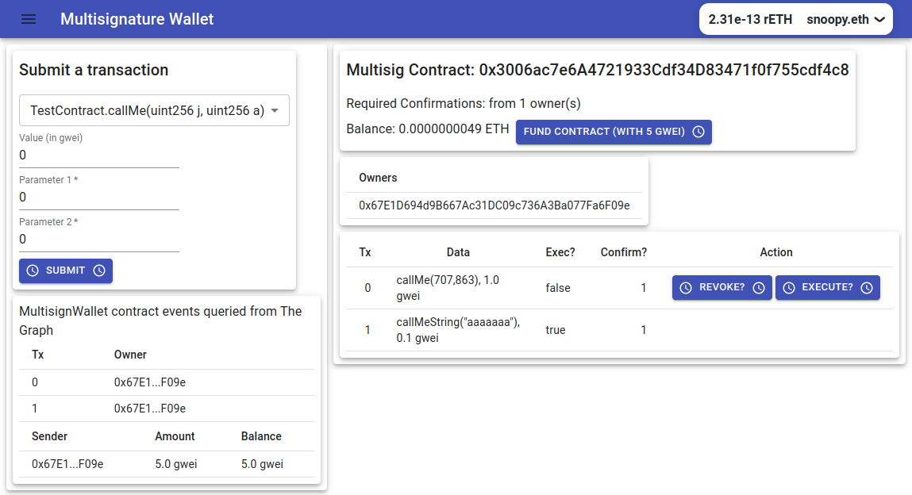

# Fullstack Ethereum React Application for the Multisignature contract

The contract is the MultiSigWallet contract, from Solidity by example site [Solidity by Example, Multi-Sig Wallet](https://solidity-by-example.org/app/multi-sig-wallet/)
It allow users to submit,confirm and execute transactions agains a TestContract

## Live client application

The client application is deployed on Netlify/Rinkeby.

https://multisigwalletfullstack.netlify.app/



## Quickstart

### `npm install`

```bash
npm install
```

To install the required packages.

### `configure .env`

Configure .env file in the multisig_wallet folder.

```bash .env
PRIVATE_KEY=0xabcdef
RINKEBY_RPC_URL ="https://eth-rinkeby.alchemyapi.io/v2/your-api-key"
UPDATE_FRONT_END=yes
```

### `start hardhat`

Please make sure to start hardhat from the multisig_wallet folder in one terminal:

```bash
npx hardhat node
```

### `add brownie network hh-local`

Then go to another terminal and add hh-local as a permanent network in brownie

```bash
brownie networks add Ethereum hh-local host=http://127.0.0.1 chainid=31337
```

### `deploy on hh-local and rinkeby`

In the same multisig_wallet folder, deploy the contracts :

```bash
brownie run scripts/brownie/deploy.py --network hh-local
brownie run scripts/brownie/deploy.py --network rinkeby
```

In the client folder, in src/index.js, uncomment chain.hardhat, in order to deploy on hardhat too:

```
const { provider, chains } = configureChains(
  [
    //chain.hardhat,
    chain.rinkeby,
  ],
  [alchemyProvider({ alchemyId: process.env.ALCHEMY_ID }), publicProvider()]
);
```

### `configure and start the client app`

Go to the client folder, install dependencies, configure .env file and start the app

### `npm install`

To install the required packages.

```bash
npm install
```

### `configure .env`

Configure .env file in the client folder.
An example of .env file :

```
GENERATE_SOURCEMAP=false
REACT_APP_ALCHEMY_ID="your-api-key"
REACT_APP_GRAPH_URL="https://api.studio.thegraph.com/query/24949/multisign_wallet/0.0.3"
```

### `start the application`

```bash
npm start
```

Runs the app in the development mode.\
Open [http://localhost:3000](http://localhost:3000) to view it in your browser.

You can switch the networks between hardhat and rinkeby.

Deployment from brownie, screenshot of console at the end:


