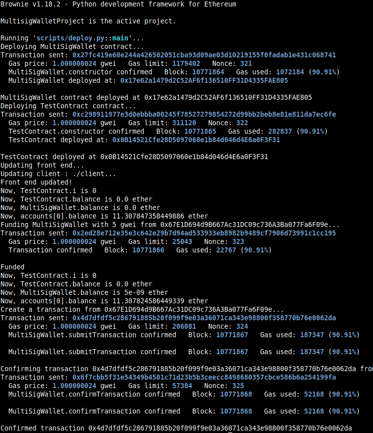

Study case of MultiSigWallet contract, from Solidity by example site [Solidity by Example, Multi-Sig Wallet](https://solidity-by-example.org/app/multi-sig-wallet/)

I used brownie with hardhat in order to deploy and use the console.log features.
You should start the hardhat node in another terminal and folder (`hh node`), then, in a terminal :

```
brownie compile
brownie run scripts/deploy.py
```

The code is filled with console.log calls in order to see the different calls and the execution of functions.

The MultiSigWallet is allowing to encode a transaction against another contract, to confirm it using multiple signatures from his owners and to submit and execute this transaction on the other contract using low-level call.

In the deploy.py script, a transaction with a call to the TestContract.callMe is encoded and executed.

For obtaining the signature of the solidity function call, we can use Web3.keccak function to manually encode the function signature and the parameters.
Another (better) method is to use the Contract.method.encode_input call in order to obtain the calldata to be submitted.

```solidity
(bool success, bytes memory returnData) = address(contract).call(payload);
require(success);
```

Here is the relevant Python code (using brownie):

```python
    transaction_value = Web3.toWei(1, "gwei")
    param1 = random_value
    param2 = random.randint(0, 2000)

    # This is how we can manually encode the function call and the parameters
    # func_signature = Web3.keccak(text="callMe(uint256,uint256)")[:4].hex()
    # params_encoded = eth_abi.encode_abi(
    #     ["uint256", "uint256"], [var1, var2]).hex()
    # calldata_encoded = func_signature+params_encoded
    # print(calldata_encoded)
    # solidity_encoded = againstContract.getData(var1, var2)
    # print(solidity_encoded)
    # assert solidity_encoded == calldata_encoded

    # This is how we encode using contract.method.encode_input
    #solidity_encoded = againstContract.getData(var1, var2)
    calldata_encoded = againstContract.callMe.encode_input(param1, param2)
    #print(f"calldata ={calldata_encoded}")
    #assert solidity_encoded == calldata_encoded

    # in the case we want to test the encoding of string parameter
    # encoding done manually
    # func_signature = Web3.keccak(text="callMeString(string)")[:4].hex()
    # paramString1 = "test"
    # params_encoded = eth_abi.encode_abi(["string"], [paramString1]).hex()
    # calldata_encoded = func_signature+params_encoded
    # print(calldata_encoded)

    # print(solidity_encoded)
    # solidity_encoded = againstContract.getDataString(paramString1)
    # or encoding done with contract.method.encode_input
    # calldata_encoded = againstContract.callMeString.encode_input(paramString1)
    # assert solidity_encoded == calldata_encoded

    tx = multiSigWallet.submitTransaction(
        againstContract.address, transaction_value, calldata_encoded, {"from": who_create})
    tx.wait(1)
```

Deployment from brownie, screenshot of console at the end:


From the hardhat console, the console.log output:

