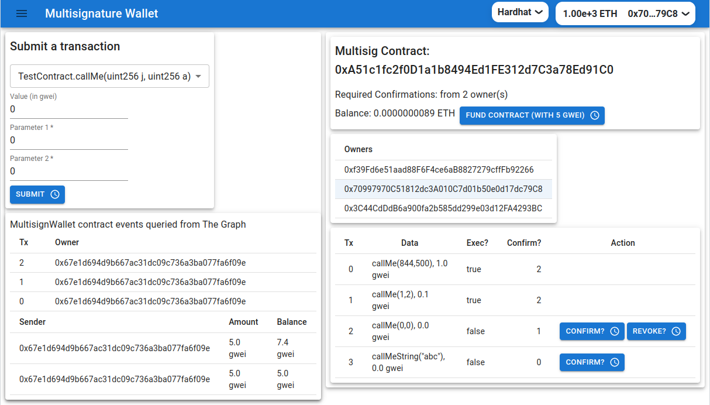

# Client Application for the Multisignature contract

It allow users to submit,confirm and execute transactions agains a TestContract

## Live client application

The client application is deployed on Netlify/Rinkeby.

https://multisigwalletfullstack.netlify.app/



## Quickstart

### `npm install`

To install the required packages.

### `configure .env`

Configure .env file in the client folder

```
GENERATE_SOURCEMAP=false
REACT_APP_ALCHEMY_ID="your-api-key"
REACT_APP_GRAPH_URL="https://api.studio.thegraph.com/query/24949/multisign_wallet/0.0.3"
```

### `deploy on hardhat`

In the client folder, in src/index.js, uncomment chain.hardhat, in order to deploy on hardhat too:

```
const { provider, chains } = configureChains(
  [
    //chain.hardhat,
    chain.rinkeby,
  ],
  [alchemyProvider({ alchemyId: process.env.ALCHEMY_ID }), publicProvider()]
);
```

### `start the application`

```bash
npm start
```

Runs the app in the development mode.\
Open [http://localhost:3000](http://localhost:3000) to view it in your browser.

You can switch the networks between hardhat and rinkeby.

## Subgraph multisign_wallet deployed on The Graph studio

In the client/src folder there is a `graphmultisignwallet` folder containing the deployement
of the MultisignWallet contract on the Rinkeby network.
